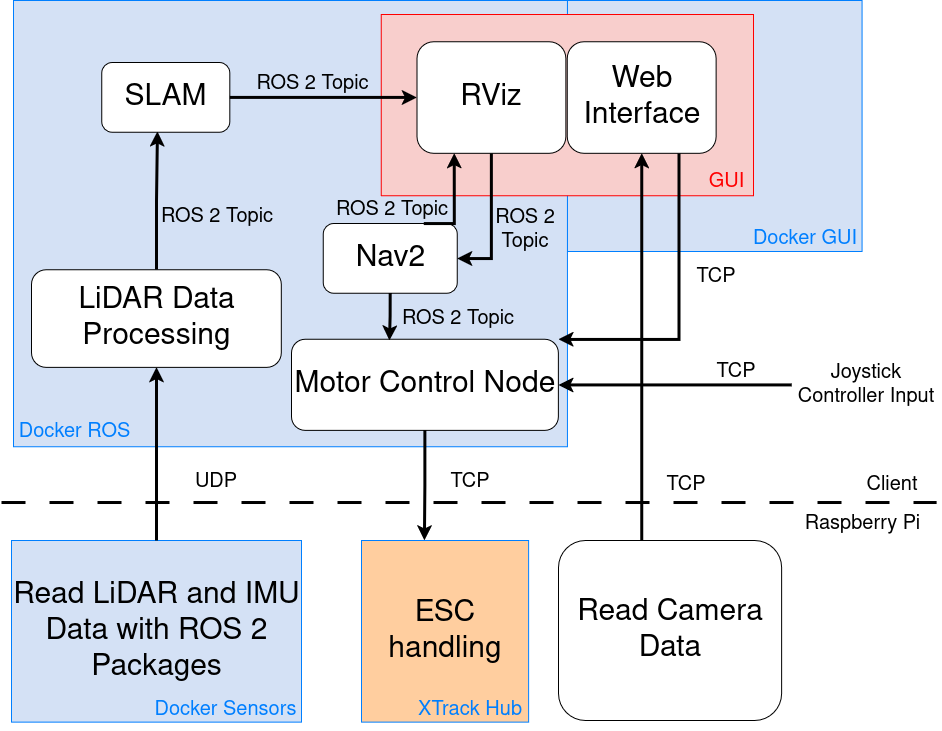
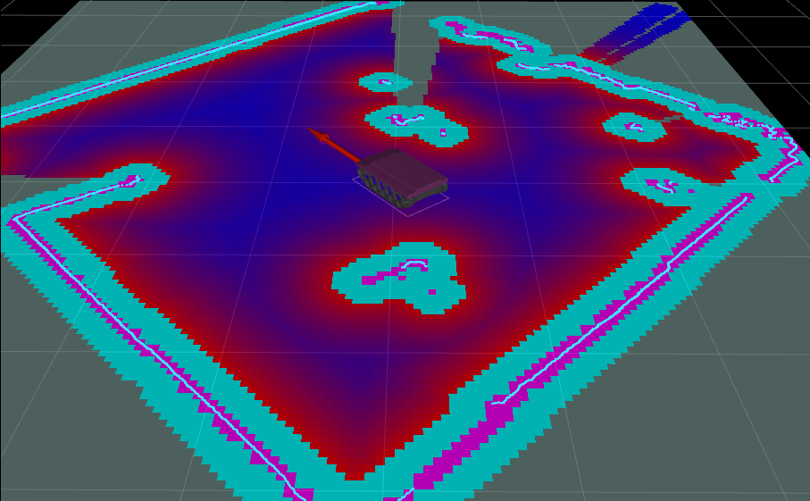
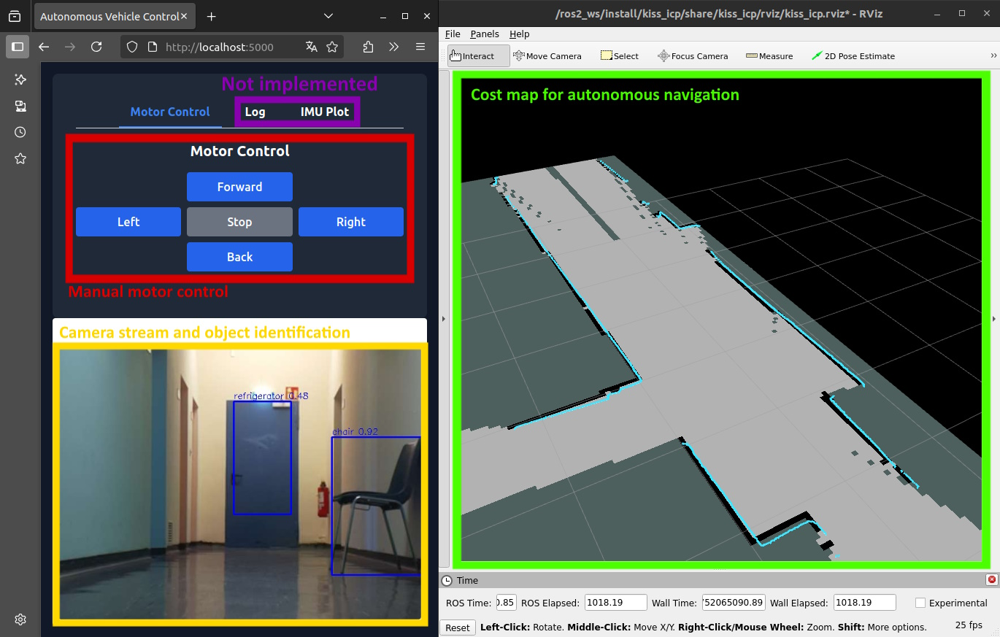
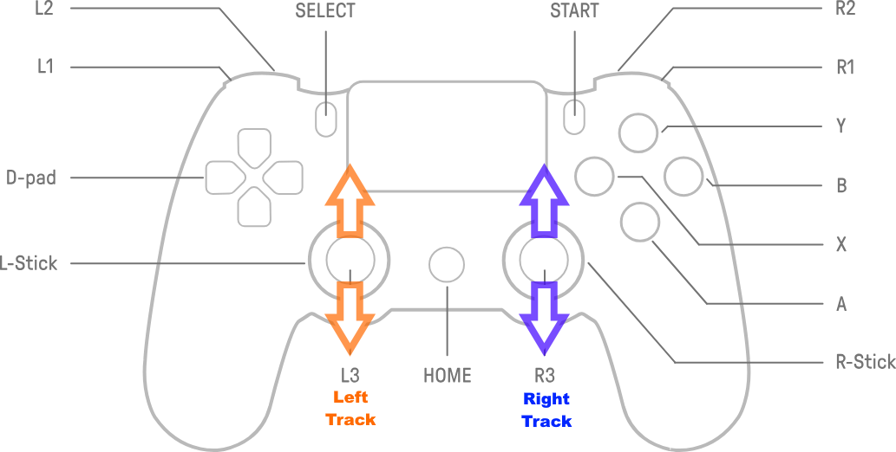

# XTRACK-A

## Description

We have developed a software framework for the autonomous navigation of a chain-tracked Vehicle called XTRACK in an unknown environment.  
The framework integrates data from the LiDAR (Light Detection and Ranging) sensor and an IMU (Inertial Measurement Unit) into a continously updated SLAM (Simultaneous Localization and Mapping) map, which is then utilized for autonomous navigation to a given point on the map.  
Whilst navigating the XTRACK will automatically avoid collision with obstacles in its environment.  
This could eventually be used for autonomous package or goods delivery or for autonomous search and/or rescue missions in difficult terrain.  


## Overview
- [Description](#description)
- [Project Structure](#project-structure)
- [Architecture](#architecture)
- [Getting Started](#getting-started)
- [Hardware](#hardware)
- [Errors & Known Problems](#errors-known-problems)
- [Roadmap](#roadmap)

## Project Structure

```
.  
├── app             # web interface and navigation 
├── docs            # documentation files              
├── motor_control   # manual on how to connect the cables + gamepad script to read controller inputs                    
├── tools           # rosbags and stl-files  
└── README.md       
```


## Architecture
### Graph
<br>
For more Details, see [Architecture Documentation](docs/architecture.md).


## Getting Started
### Requirements
**ONLY WORKS ON A LINUX OS.**  
If you do not have a Linux OS installed, please see [here](https://www.google.com/search?client=firefox-b-lm&channel=entpr&q=how+to+install+linux+os).  
Make sure you have Docker installed.

### Installation
Make sure the mounts and hardware are attached correctly before proceeding. For guidance, refer to the [Mount](docs/mounts.md) and [Hardware Guide](docs/hardware.md).  
Currently, the mounts should be installed correctly.

### Configuration
Make sure your device is connected to the WiFi "FF_Launchpad".  
Make sure the joystick controller is charged and connected to your device.  
Make sure your browser is in light mode.
Make sure the hardware is set up correctly, according to the [Hardware Documentation.](docs/hardware.md)
Check the battery charge of the two main batteries and ensure they are charged.  
Look up the ip adress of your device by executing:
```
hostname -I
```
It should look something like this: 192.168.0.121  

### Usage

#### Raspberry PI
Connect to the Raspberry PI by doing:
```
ssh pia@teamA.local
```
Password:
```
TUBerlin2025+
```


Once you are connected to the PI, open the config:
```
nano config.sh
```
And set the ip address to your clients ip:
```
IP_ADDRESS="<your_ip>"
```

Then, execute:
```
./start_host.sh
```

#### Client (Your device)
Please clone this git repository:
```
git clone https://git.tu-berlin.de/FF/progpra-pcbs-av/a-so2025/pcps.git
```
Open a Terminal in the directory of the git repository and update and clone the submodules with:
```
git submodule update --init
```

To start the web interface and your slam mapping, do:
```
cd app/client/
xhost +local:docker  
export DISPLAY=:0
./start_client.sh
```
**Note: This step may take a while, depending on your download rate.**

After launching navigation, your slam map should be loaded with a corresponding cost map and base footprint in Rviz2:

<br>

(⚠️): If Rviz2 is empty verify if the lidar communication is still working. See [Error Guide](docs/error_guide.md) for more information.

It is possible to adjust the color of the cost map under the `Color_Scheme` map property.

For optimal usability, we recommend manually arranging the windows so that Rviz2 is positioned on the right side of the screen and the web interface on the left, allowing for seamless side-by-side interaction and visualization:  <br>
<br>

**Restart process starting from "Starting the mapping:" if Map is incorrect or faulty.**
Set a target position with the `2D Goal Pose` plugin in Rviz2. To terminate a navigation command the Navigation Panel from Rviz2 can be used (Panels -> Add New Panel -> Navigation 2 -> Pause) or terminate the ros2 nodes with Ctrl + C in the terminal.

Notes:

(⚠️) if the XTrack doesnt find a path or cant translate the command velocities from nav2 after a certain time it will do a fast rotation around its own axis, so keep this in mind to keep your walls clean and safe.

You can find recorded ros bags to test the configuration without the sensor hardware [here](tools/ros%20bags/).

**To open the web interface, open localhost:5000 on your browser.**

##### Manual Motor Control
<br>
In order to manually control the vehicle, simply use the joysticks to interrupt the autonomous Navigation.  
The left joystick(L3) steers the left track, while the right joystick(R3) controls the right one.  
**Note: You may use this manual control to explore the vicinity to enhance your SLAM map before moving on to the next step.**

## Hardware
For comprehensive help and information about the hardware installation process, consult the [Hardware Documentation.](docs/hardware.md)

## Errors & Known Problems
Since this is a prototype, occasional errors may occur.  
Should any errors arise or the process not operate as intended, you may need to start the process manually.
You can find detailed instructions here: [Manual Start Guide](docs/manual_start.md)  
Also, for troubleshooting and guidance, please refer to the [Error Guide](docs/error_guide.md).  

Since the software framework is still in development, there are a few known problems that have to be addressed in further development.   
These can be found [here](docs/open_todos.md).  

## Open Issues
- **#62: Sensor Failsafes**
Robust error handling for sensor disconnections or malfunctions.

- **#88: Autonomous Exploration**
Implementation of SLAM-based autonomous navigation and mapping.

- **#94: Multi-OS Support**
Full Windows and macOS support for development and deployment.

## Roadmap

### Upcoming Features
- **Sensor Failsafes** (see #62)

- **Autonomous Exploration** (see #88)

- **Multi-OS Support** (see #94)

### Future Goals
- **3D LiDAR**
Expansion of LiDAR capability to support 3D.

- **Simulation**
Simulation environment of the XTrack for operator training and autonomous navigation

- **Exploration**
Algorithm for autonomous navigation and mapping for the XTrack
