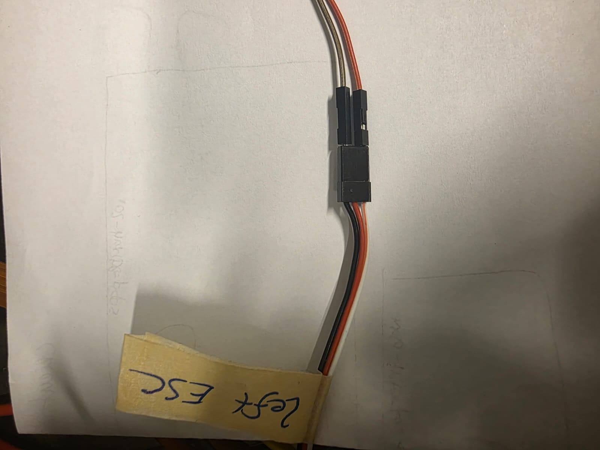
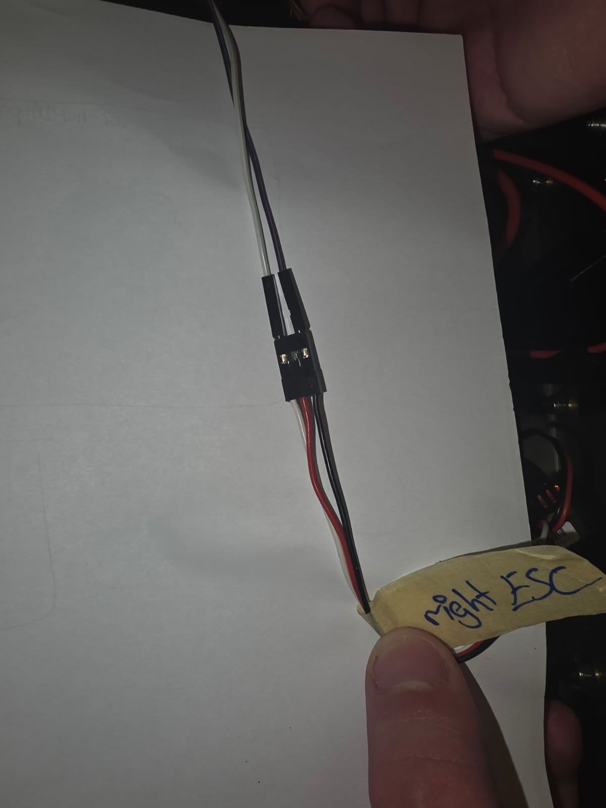

# GPIO Pin connection 
PLEASE DO NOT TOUCH the cables if they are already connected!

Then connect the correct pins of the raspberry pi with the ESCs, like this:

<br>

<br>

<br>
```
1. Vebinde GPIO 18 (Pin 12) mit dem weißen Kabel vom linken ESC	(rot->weiß)
2.Verbinde GND (Pin 14) mit dem schwarzen Kabel vom linken ESC	(braun->schwarz)
3.Vebinde GPIO 13 (Pin 33) mit dem weißen Kabel vom rechten ESC	(weiß->weiß)
4.Verbinde GND (Pin 39) mit dem schwarzen Kabel vom rechten ESC	(lila->schwarz)
```